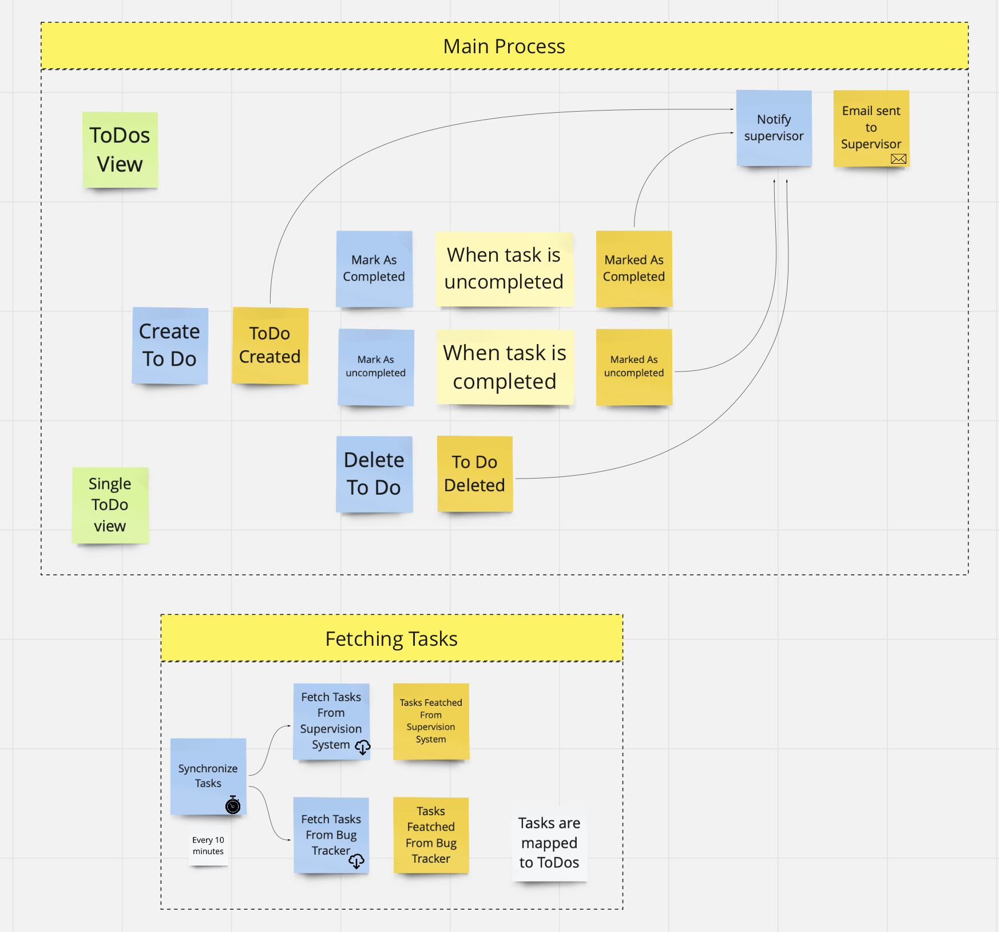
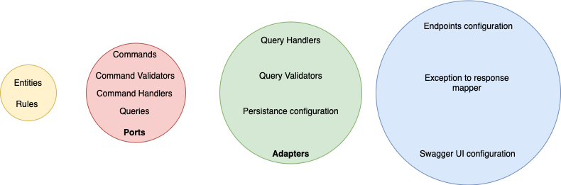

# API using .NET 6 and minimal API approach

## Goals of this repository 
- test new features provided by .NET 6 (mainly new Minimal Api approach)
- all code that focuses on technical stuff like Command or Queries Dispatcher should be separated from Application Code. Goal is move there as much code as it possible and just use it application. 
- project domain is dead simple, architecture and solutions inside this repository are overkill for this domain 

## Project Domain

It's simple To Do solution, when user can create 'to dos' and mark them as completed. To Dos are periodicaly created based on Task from **Supervisor system and Bug Tracker**. 

## Architecture

Architecture is inspired by Clean Architecture invented by Uncle Bob with some modifications. 

### Big picture (layers)

### Implementation Details

## Building Blocks

Purpose of this project is separate tehcnical details no needed from domain or use cases perspective. Building blocks can be treated as Framework for create microservice. 

## Decision log 

### Create own command and query handling instead of using MediatR. 
- I don't want to relay on external library (all stuffs that i need i can write by myself). 
- Clean code, without any external dependencies (so I don't need to reference MediatR in all projects)
- Separated pipelines for queries and commands (MediatR always have one pipeline for all stuffs)

### Validation

Domain validation should check business invariants. That means, if you need to validate a string lenght you need ask yourself why you would like to do it.

  a) if you got special values like credit card number, of course lenght is first and important business rule and should be in Domain layer
  
  b) if you want to limit number of characters for UI purposes, like in ToDo Title lenght, it should be done in application layer. Why in Application Layer instead of API? Imagine case when you create feature that allows user fill form by UI but then you need to allow users also send the same form using Email. Validation of input paramteres will be the same, but in case of Email, API will be not involved anymore
  
### Separated request Dtos instead of using directly Command in Api project

Separation of concerns, If i decide to add swagger adnnotations for make better specification then I don't put this information inside Application Logic

### Do not use FluentValidator

Due to I want to have distinguish between Use Case Rules Validation and Struct. In Fluent Validator is not achievable.

### Initially I wanted to test Aspect oriente approach, but I finally I abandoned this idea
   - There is no open source library that will help write Aspects
   - There is a Post Sharp library that will fit my needs, but it is paid one so I won't use it
   - Decorators are enough for most cases
   
   
### Do not use Problem Details library for mapping exceptions to response
- The main reason is that I don't want to include in all project that will use ExceptionMiddleware dependecies from 3rd party library
- With my own code it's easy to create default rules for mapping and overide it in easy way
