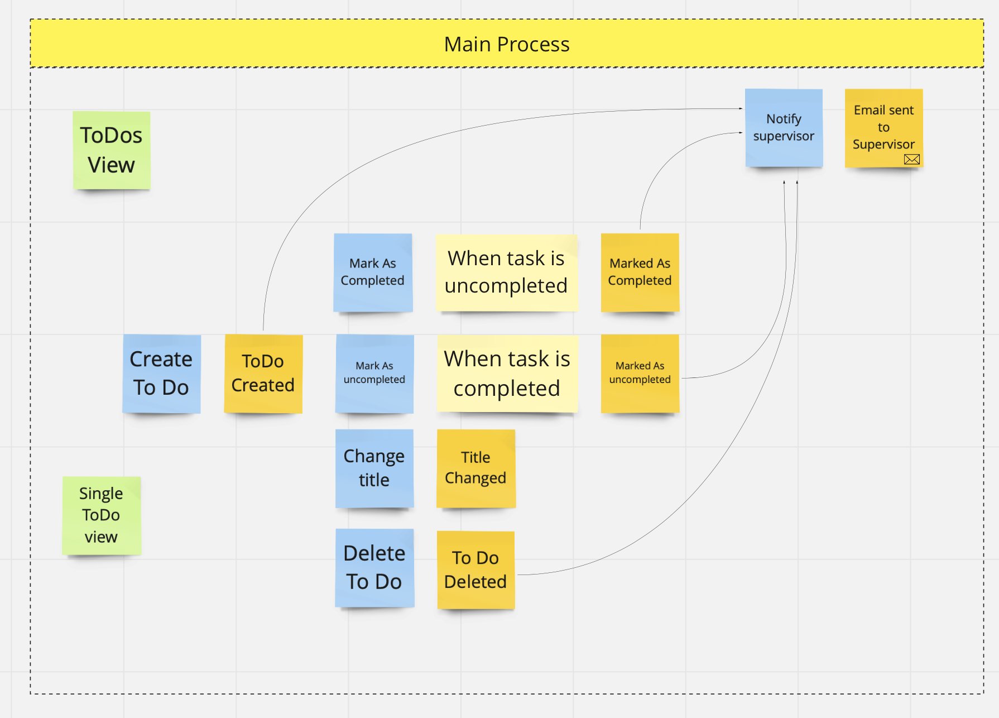

# API using .NET 6 and minimal API approach and also Aspect Oriented Programming

## Goals of this repository 
- test new features provided by .NET 6 (mainly new Minimal Api approach)
- try Aspect Oriented Programming (for Logging, Caching and Exception Handling)
- try to make solution that is not focusing on technical parts (hide all infrastructure details and make code easy to understand use cases and domain) 

## Project Domain

It's simple To Do solution, when user can create 'to dos' and mark them as completed. To Dos are periodicaly created based on Task from **Supervisor system and Bug Tracker**. 

